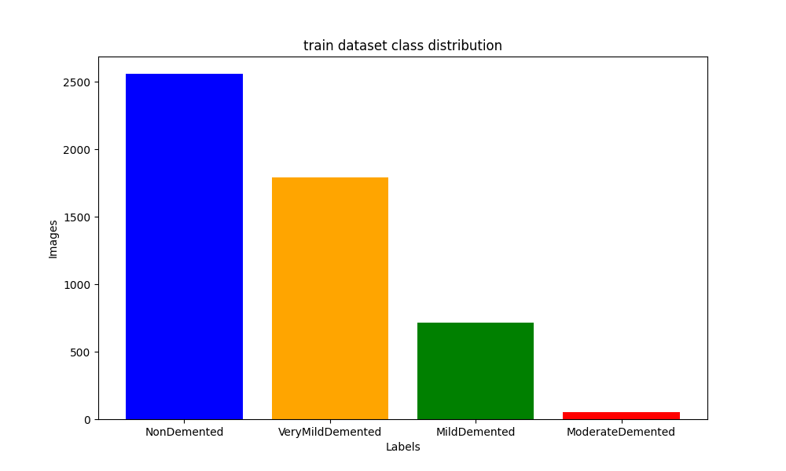

# Stage of Alzheimer's classification.

The purpose of this project is to detect the stage of Alzheimer's based on MRI images.

# Dataset

The models are designed to be trained on [Alzheimer's Dataset ( 4 class of Images)](https://www.kaggle.com/datasets/tourist55/alzheimers-dataset-4-class-of-images) from Kaggle.
It has already been downloaded and is available in the dataset/ directory.

<p align="center">
  
  
</p>

# Usage

### Requirements
* Python 3.11+
* Poetry

### Training a model

    python train.py -m vgg16 -f model_filename
        -m/--model_name: Name of the model to train (vgg16 or cnn).
        -f/--filename: Filename to save the trained model.

### Predicting with a model

    python predict.py -m vgg16 -f model_filename -i path_to_image
        -m/--model_name: Name of the model to use for prediction (vgg16 or cnn).
        -f/--filename: Filename of the trained model.
        -i/--image_path: Path to the image file to predict.

# Development
## Pre-commits
Install pre-commits
https://pre-commit.com/#installation

If you are using VS-code install the extension https://marketplace.visualstudio.com/items?itemName=MarkLarah.pre-commit-vscode

To make a dry-run of the pre-commits to see if your code passes run
```
pre-commit run --all-files
```


## Adding python packages
Dependencies are handled by `poetry` framework, to add new dependency run
```
poetry add <package_name>
```